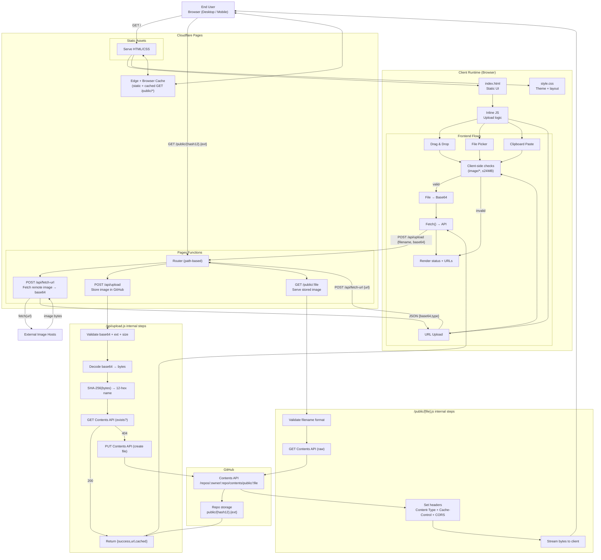

[Try Now](https://dr-fast-upload.pages.dev)

```mermaid
flowchart TD
    %% =========================================================
    %% ACTOR
    %% =========================================================
    User["End User<br/>Browser (Desktop / Mobile)"]

    %% =========================================================
    %% CLIENT-SIDE
    %% =========================================================
    subgraph Client["Client Runtime (Browser)"]
        HTML["index.html<br/>Static UI"]
        CSS["style.css<br/>Theme + layout"]
        JS["Inline JS<br/>Upload logic"]

        subgraph UI["Frontend Flows"]
            DragDrop["Drag & Drop"]
            FilePicker["File Picker"]
            Paste["Clipboard Paste"]
            URLFlow["URL Upload"]

            ValidateClient["Client-side checks<br/>(image/*, ≤24MB)"]
            EncodeClient["File → Base64"]
            CallAPI["Fetch() → API"]
            Render["Render status + URLs"]
        end
    end

    %% =========================================================
    %% CLOUDFLARE PAGES
    %% =========================================================
    subgraph CF["Cloudflare Pages"]
        subgraph Static["Static Assets"]
            StaticAssets["Serve HTML/CSS"]
        end
        subgraph Fn["Pages Functions"]
            Router["Router (path-based)"]
            FetchUrlFn["POST /api/fetch-url\nFetch remote image → base64"]
            UploadFn["POST /api/upload\nStore image in GitHub"]
            PublicFn["GET /public/:file\nServe stored image"]
        end
        EdgeCache["Edge + Browser Cache\n(static + cached GET /public/*)"]
    end

    %% =========================================================
    %% EXTERNALS
    %% =========================================================
    External["External Image Hosts"]
    subgraph GitHub["GitHub"]
        ContentsAPI["Contents API\n/repos/:owner/:repo/contents/public/:file"]
        RepoStore["Repo storage\npublic/{hash12}.{ext}"]
    end

    %% =========================================================
    %% STATIC LOAD
    %% =========================================================
    User -->|"GET /"| StaticAssets
    StaticAssets --> HTML --> JS
    StaticAssets --> CSS
    StaticAssets <--> EdgeCache

    %% =========================================================
    %% CLIENT INPUT PATHS
    %% =========================================================
    JS --> DragDrop --> ValidateClient
    JS --> FilePicker --> ValidateClient
    JS --> Paste --> ValidateClient

    %% URL uploads are fetched server-side to avoid browser CORS issues
    JS --> URLFlow -->|"POST /api/fetch-url {url}"| Router
    Router --> FetchUrlFn -->|"fetch(url)"| External
    External -->|"image bytes"| FetchUrlFn
    FetchUrlFn -->|"JSON {base64,type}"| URLFlow
    URLFlow --> ValidateClient

    ValidateClient -->|"valid"| EncodeClient --> CallAPI
    ValidateClient -->|"invalid"| Render

    %% =========================================================
    %% UPLOAD FLOW
    %% =========================================================
    CallAPI -->|"POST /api/upload {filename, base64}"| Router
    Router --> UploadFn

    subgraph UploadSteps["/api/upload.js internal steps"]
        U1["Validate base64 + ext + size"]
        U2["Decode base64 → bytes"]
        U3["SHA-256(bytes) → 12-hex name"]
        U4["GET Contents API (exists?)"]
        U5["PUT Contents API (create file)"]
        U6["Return {success,url,cached}"]
    end

    UploadFn --> U1 --> U2 --> U3 --> U4
    U4 -->|"200"| U6
    U4 -->|"404"| U5 --> ContentsAPI --> RepoStore --> U6
    U6 --> CallAPI --> Render

    %% =========================================================
    %% PUBLIC SERVE FLOW
    %% =========================================================
    User -->|"GET /public/{hash12}.{ext}"| Router
    Router --> PublicFn

    subgraph PublicSteps["/public/[file].js internal steps"]
        P1["Validate filename format"]
        P2["GET Contents API (raw)"]
        P3["Set headers\nContent-Type + Cache-Control + CORS"]
        P4["Stream bytes to client"]
    end

    PublicFn --> P1 --> P2 --> ContentsAPI
    ContentsAPI --> P3 --> P4 --> User
    User <--> EdgeCache
```

